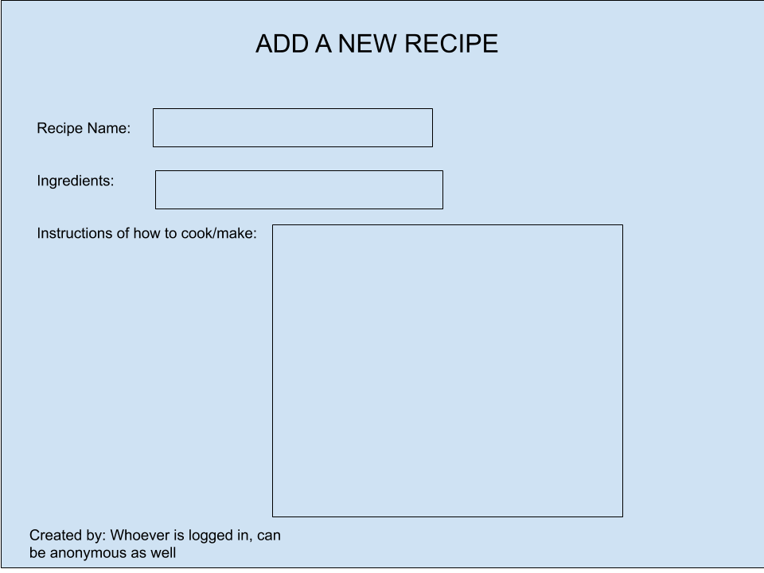
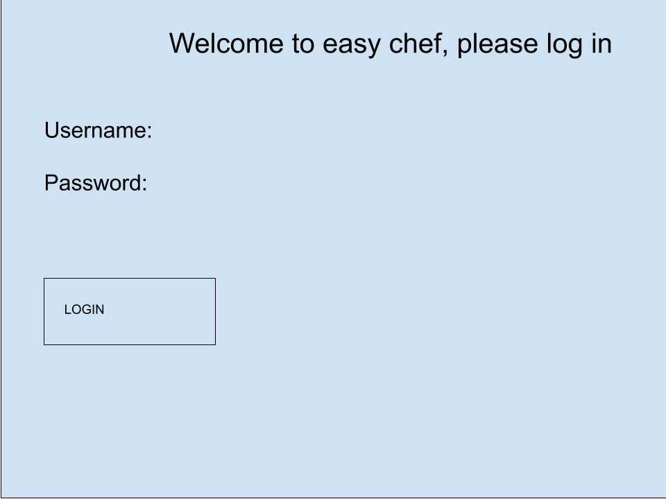
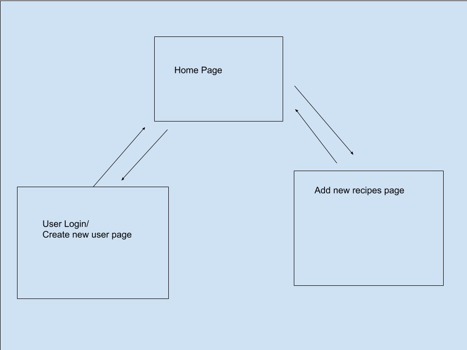

The content below is an example project proposal / requirements document. Replace the text below the lines marked "__TODO__" with details specific to your project. Remove the "TODO" lines.

Simple Dan's Recipe Book

# Shoppy Shoperson 

## Overview

My project is a recipe/ online cookbook. Where authors can provide their recipes onto the web page. 
It will provide many recipes in of which people with accounts can create, so that an the author of the 
recipe can get recognition for it. The recipes will contain the name of the recipe, ingredients required 
to make the dish, followed by the steps on how to create. There will also be images that can be shown as
the 'expected' end result. People can also filter the dishes they want by name, or rather to be more specific if they want to cook a certain dish with a certain ingredient. They can filter by ingredients and see which dish specifically contains that desired ingredient.


## Data Model


The application will store Users, Recipes, Ingredients and Instruction on how to cook the recipes

* users can have multiple recipes
* each recipe can vary, 
* anonymous users can also post recipes/dishes (this may be changed)

SAMPLE DOCUMENTS:

An Example User:

```javascript
{
  username: "shannonshopper",
  hash: // a password hash,
}
```

An Example List with Embedded Items:

```javascript
{
  user: // a reference to a User object
  dish: "Cheesy scramble",
  ingredients: "eggs, cheese, salt, pepper"
  instructions: "step 1: cook, step 2: dont burn. Rinse and repeat"
  createdAt: // timestamp
}
```


## [Link to Commented First Draft Schema](db.js)

(___TODO__: create a first draft of your Schemas in db.js and link to it_)

## Wireframes


(___TODO__: wireframes for all of the pages on your site; they can be as simple as photos of drawings or you can use a tool like Balsamiq, Omnigraffle, etc._)

/cook/add adding a recipe to the homepage



/home - page for showing all recipes


/cook/login - login/user creation page



## Site map

(___TODO__: draw out a site map that shows how pages are related to each other_)

Here's a [complex example from wikipedia](https://upload.wikimedia.org/wikipedia/commons/2/20/Sitemap_google.jpg), but you can create one without the screenshots, drop shadows, etc. ... just names of pages and where they flow to.



## User Stories or Use Cases

1. As a non-registered user you can create an account
2. As a non-registered user you can also post recipes anonomously
3. As a user you can add recipes
4. There recipes will contain your username and the date in which you posted it
5. As a user you can see what recipes you have contributed
6. As a user you can edit your recipes or create additions to them.


## Research Topics

(___TODO__: the research topics that you're planning on working on along with their point values... and the total points of research topics listed_)


1. Vue.js (5 points) want to try and implement something not using node.js
Vue.js is state of the art and is currently a hot topic. But its libraries are also very challenging to learn.
2. User Athentication (4 points)
  create a user/password login system. 

Total points: 9


## [Link to Initial Main Project File](app.js) 

(___TODO__: create a skeleton Express application with a package.json, app.js, views folder, etc. ... and link to your initial app.js_) (Done)

## Annotations / References Used

(___TODO__: list any tutorials/references/etc. that you've based your code off of_)

1. [passport.js authentication docs](http://passportjs.org/docs) - (add link to source code that was based on this)
2. [tutorial on vue.js](https://vuejs.org/v2/guide/) - (add link to source code that was based on this)

^^^ Please refer to the above

